Lab \#2: Ames Housing Data
================

<!-- README.md is generated from README.Rmd. Please edit the README.Rmd file -->

**Our analysis of the Ames housing data revealed these findings:**

Sale prices can range from 0 to over 4.5 million with most properties
being between \$100,000-\$500,000.

There are some outliers with properties that have \$0 sale price which
are most likely errors in the dataset.

Property characteristics like living area, bedrooms, and neighborhood
strongly affect sale prices.

Newer properties and those with air conditioning have higher pricing on
average.

The distribution of price differs from neighborhood to neighborhood,
with some areas having median prices 3x higher than others

**Step 1 - Variables and What They Mean**

    ## 
    ## Attaching package: 'dplyr'

    ## The following objects are masked from 'package:stats':
    ## 
    ##     filter, lag

    ## The following objects are masked from 'package:base':
    ## 
    ##     intersect, setdiff, setequal, union

    ## # A tibble: 6 × 16
    ##   `Parcel ID` Address      Style Occupancy `Sale Date` `Sale Price` `Multi Sale`
    ##   <chr>       <chr>        <fct> <fct>     <date>             <dbl> <chr>       
    ## 1 0903202160  1024 RIDGEW… 1 1/… Single-F… 2022-08-12        181900 <NA>        
    ## 2 0907428215  4503 TWAIN … 1 St… Condomin… 2022-08-04        127100 <NA>        
    ## 3 0909428070  2030 MCCART… 1 St… Single-F… 2022-08-15             0 <NA>        
    ## 4 0923203160  3404 EMERAL… 1 St… Townhouse 2022-08-09        245000 <NA>        
    ## 5 0520440010  4507 EVERES… <NA>  <NA>      2022-08-03        449664 <NA>        
    ## 6 0907275030  4512 HEMING… 2 St… Single-F… 2022-08-16        368000 <NA>        
    ## # ℹ 9 more variables: YearBuilt <dbl>, Acres <dbl>,
    ## #   `TotalLivingArea (sf)` <dbl>, Bedrooms <dbl>,
    ## #   `FinishedBsmtArea (sf)` <dbl>, `LotArea(sf)` <dbl>, AC <chr>,
    ## #   FirePlace <chr>, Neighborhood <fct>

    ## tibble [6,935 × 16] (S3: tbl_df/tbl/data.frame)
    ##  $ Parcel ID            : chr [1:6935] "0903202160" "0907428215" "0909428070" "0923203160" ...
    ##  $ Address              : chr [1:6935] "1024 RIDGEWOOD AVE, AMES" "4503 TWAIN CIR UNIT 105, AMES" "2030 MCCARTHY RD, AMES" "3404 EMERALD DR, AMES" ...
    ##  $ Style                : Factor w/ 12 levels "1 1/2 Story Brick",..: 2 5 5 5 NA 9 5 5 5 5 ...
    ##  $ Occupancy            : Factor w/ 5 levels "Condominium",..: 2 1 2 3 NA 2 2 1 2 2 ...
    ##  $ Sale Date            : Date[1:6935], format: "2022-08-12" "2022-08-04" ...
    ##  $ Sale Price           : num [1:6935] 181900 127100 0 245000 449664 ...
    ##  $ Multi Sale           : chr [1:6935] NA NA NA NA ...
    ##  $ YearBuilt            : num [1:6935] 1940 2006 1951 1997 NA ...
    ##  $ Acres                : num [1:6935] 0.109 0.027 0.321 0.103 0.287 0.494 0.172 0.023 0.285 0.172 ...
    ##  $ TotalLivingArea (sf) : num [1:6935] 1030 771 1456 1289 NA ...
    ##  $ Bedrooms             : num [1:6935] 2 1 3 4 NA 4 5 1 3 4 ...
    ##  $ FinishedBsmtArea (sf): num [1:6935] NA NA 1261 890 NA ...
    ##  $ LotArea(sf)          : num [1:6935] 4740 1181 14000 4500 12493 ...
    ##  $ AC                   : chr [1:6935] "Yes" "Yes" "Yes" "Yes" ...
    ##  $ FirePlace            : chr [1:6935] "Yes" "No" "No" "No" ...
    ##  $ Neighborhood         : Factor w/ 42 levels "(0) None","(13) Apts: Campus",..: 15 40 19 18 6 24 14 40 13 23 ...

**Here are the 16 variables and what they mean in this dataset:**

Parcel ID (Character): A unique identifier for each property parcel in
the form of a 10-digit code.

Address (Character): The street address of each property including city.

Style (Factor): A category description with 12 types that describe the
style of the property.

Occupancy (Factor): A category description with 5 types that describes
the type of residential housing it is.

Sale Date (Date): The date when the property sale happened, formatted as
year-month-day.

Sale Price (Numeric): The price of the property in US dollars and it
ranges anywhere from \$0 to \$4,496,640 (of course the \$0 entries are
outlines/anomalies).

Multi Sale (Character): A variable for multiple sales. This seems to
appears to have mostly “NA” entries.

Year Built (Numeric): The year the property was built. This ranges from
the 1800s to present.

Acres (Numeric): The lot size measured in acre and this ranges from
small values like (0.023) to larger properties.

Total Living Area (sf) (Numeric): The actual living space in square
feet. Ranges quite largerly from property to property.

Bedrooms (Numeric): The number of bedrooms in each property. This
typically ranges from 1 to 5+ bedrooms.

Finished Bsmt Area (sf) (Numeric): The finished basement area in square
feet and the many “NA” values means there might be no basement.

Lot Area (sf) (Numeric): The total lot area in square feet, and seems to
correlate strongly with acres.

AC (Character): Air conditioning variable with “Yes” or “No” values to
describe if the property has AC or not

FirePlace (Character): A variable with “Yes” or “No” values to describe
if fire place is present in property.

Neighborhood (Factor): Geographic categorical type variable with 42
different neighborhood codes representing areas within Ames.

In conclusion, this dataset has 6,935 entries that are made up of house
related measurements, categories, and character descriptors that all
work to describe the property characteristics and sales associated with
them in Ames since 2017.

**Step 2 - Variable Of Interest** Yes, Sale Price is the variable of
special interest/focus

    ##     Min.  1st Qu.   Median     Mean  3rd Qu.     Max. 
    ##        0        0   170900  1017479   280000 20500000

**Step 3 - Histogram Showing Sale Price**

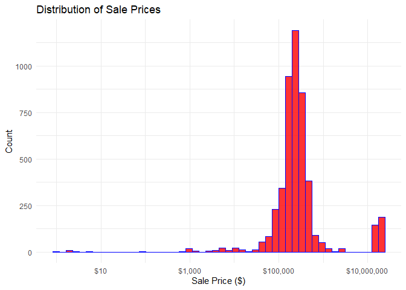<!-- -->

# 

**Step 4 - Group Members Work**

**Ivy’s Work:**
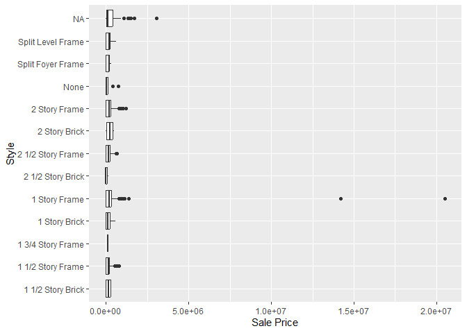<!-- -->

The original boxplot of Sale Price by Style showed that there were a few
extreme outliers, especially in the 1 Story Frame category. These
outliers, with sale prices well above typical values, caused the rest of
the data to appear squashed near the bottom, making the plot difficult
to interpret.

To address this, I filtered the dataset to only include houses with Sale
Price below \$1,000,000. This removed the extreme values and produced a
clearer, more readable boxplot. With the adjustment, the differences in
median sale prices across styles became more apparent, while still
capturing the overall variability within each category.

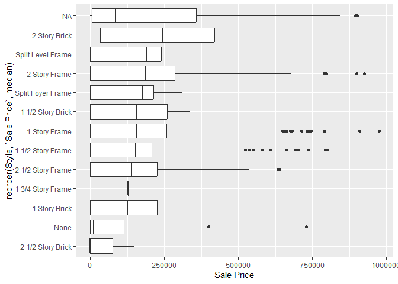<!-- -->

The adjusted plot looks much clearer after removing extreme outliers
above \$1,000,000. However, I also noticed that the distribution
included houses with a Sale Price of 0, which is not realistic in real
life and likely represents data entry errors or missing values.

To improve data quality, I filtered out these observations by keeping
only houses with Sale Price greater than 0. This results in a more
meaningful visualization, since all remaining values correspond to valid
housing transactions.

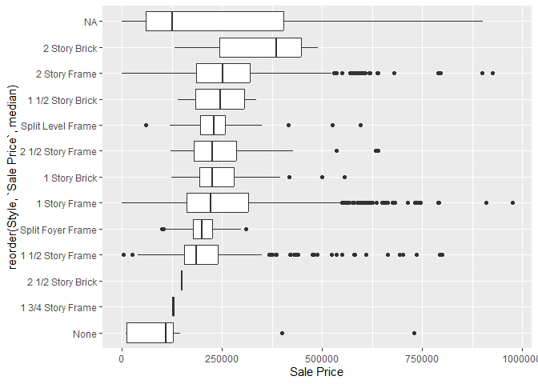<!-- -->

And this will be the final plot.

\#Interpretation:

The dataset includes many different housing styles (e.g., 2 Story Brick,
2 Story Frame, 1 Story Frame, Split Foyer Frame). In the final plot, the
categories are reordered by their median Sale Price, making it easier to
compare which styles tend to be more expensive.

\#Overall pattern:

2 Story Brick homes have the highest median sale prices, standing out
from the other styles.

Styles such as Split Foyer Frame and 1 3/4 Story Frame generally sell
for lower prices.

The NA category displays unusually high variation and extreme values,
likely due to data entry errors or missing style information.

Within each style, there is a substantial spread in sale prices,
reflected in the box lengths and outliers, which suggests that factors
beyond style (such as living area, year built and etc.) also strongly
influence housing prices.

**Owen’s work:**

    ## [1]  0 10

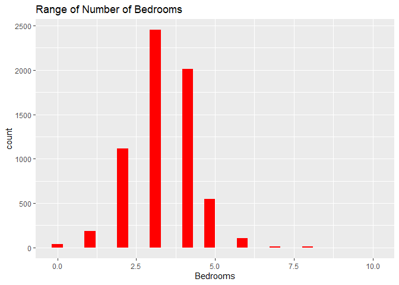<!-- -->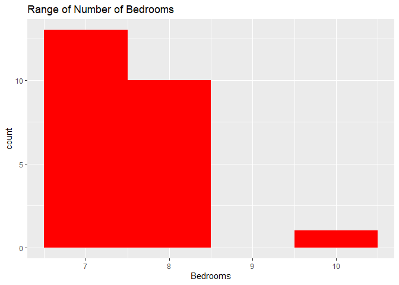<!-- -->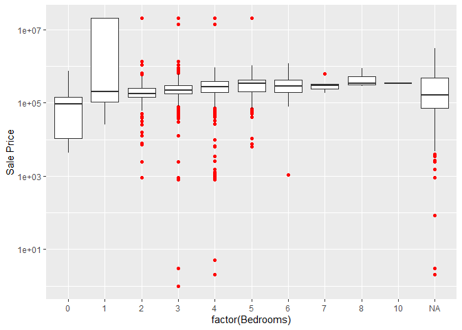<!-- -->

The range of number of bedrooms is 1 - 10, most are within the range of
2 - 5.

The number of bedrooms does not have much correlation to the sale price.
There are many outliers in the sale price with some houses being far
more expensive than others regardless of the number of bedrooms.

**Lexi’s Work: **

## what is the range of that variable? plot. describe the pattern.

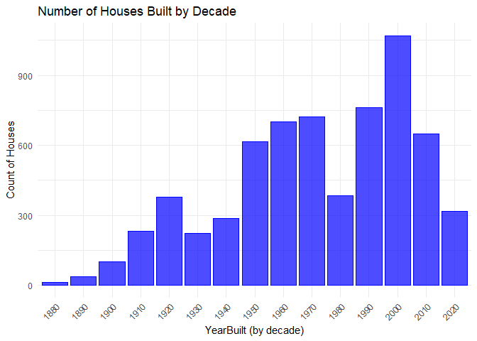<!-- -->

### Interpretation:

The variable YearBuilt ranges roughly from the late 1800s to 2010 (with
some missing values). The histogram shows construction booms around the
1920s–1930s and again in the 2000s, while other decades had fewer houses
built.

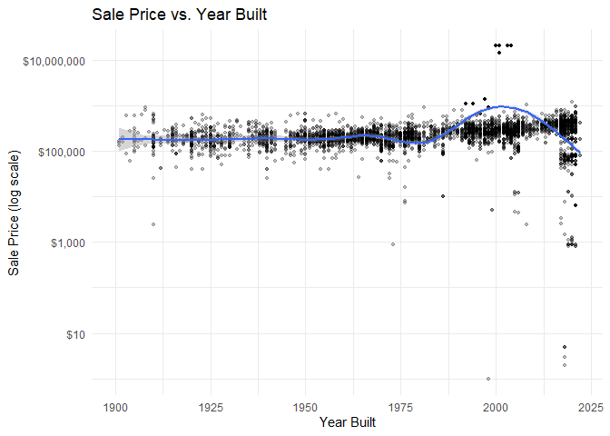<!-- -->

### Interpretation:

The scatterplot shows the relationship between YearBuilt and the main
variable, Sale Price. The overall pattern suggests that newer houses
tend to sell for higher prices. Houses built before about 1950 cluster
at lower prices, while those built between 1975 and 2005 show a clear
increase in sale price. After 2010, the trend levels off or dips
slightly, which may reflect fewer recent transactions in the dataset.

This variable also helps explain some of the oddities discovered in Step
3. For example, there are older homes (pre-1900) with unusually high
sale prices. These may represent historic properties or extensively
renovated houses that deviate from the general trend. Additionally,
there are some recently built homes with very low or zero sale prices,
which could be recording errors, distressed sales, or non-arm’s length
transactions. Overall, YearBuilt has a strong and intuitive relationship
with sale price: newer homes generally command higher values, but the
presence of both high-priced old homes and low-priced new homes shows
that other factors (location, renovations, condition) also play a role.

**Marcus Work** variable = TotalLivingArea

what is the range of that variable? plot. describe the pattern.

    ## [1]    0 6007

    ## [1] 6007

The range is (0:6007) square feet

what is the relationship to the main variable?

    ## `geom_smooth()` using formula = 'y ~ x'

<!-- -->

    ## `geom_smooth()` using formula = 'y ~ x'

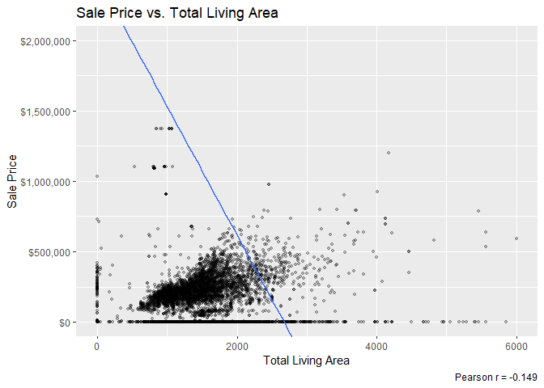<!-- -->

There is a small correlation between TotalLivingArea and Sale Price with
an r of -0.184. as shown in the plot. There are about a dozen outliers
with a 13,000,000+ sale price and less than 1500 TotalLivingArea which
isn’t consistent with the rest of the data. you can see these in the top
graph, but it is impossible to get much information because it isnt
zoomed in. Theres also a good ammount of 0 sf areas in the dataset. so
overall, theres a small correlation statistically, but with the zoom in
plot you can see that it is positivley correlated with the vast majority
of the dataset but those outliers heavily effect the r value.

**Anthony’s Work**

    ## 
    ##                    Condominium Single-Family / Owner Occupied 
    ##                            711                           4711 
    ##                      Townhouse          Two-Family Conversion 
    ##                            745                            139 
    ##              Two-Family Duplex 
    ##                            182

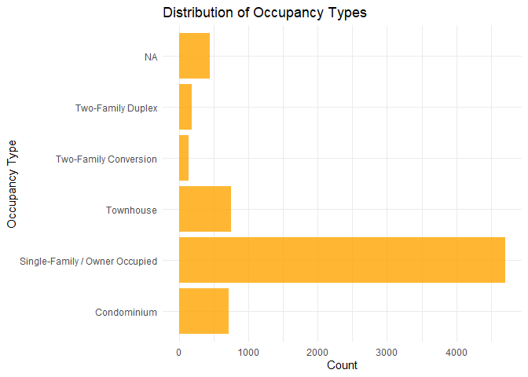<!-- -->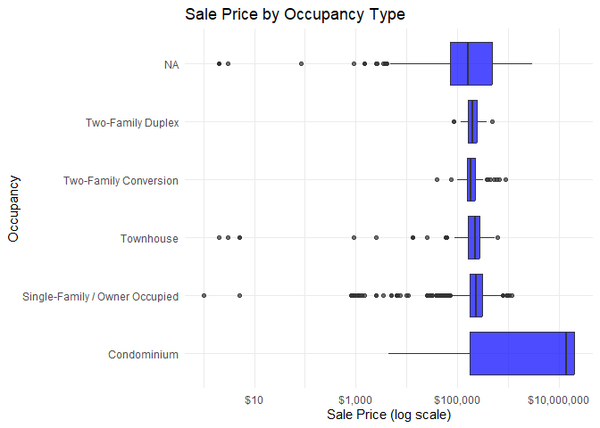<!-- -->

**Interpretation**

Occupancy has about 5 categories (Single Family, Condo, Townhouse,
Duplex, Apartment). The dataset is mostly made up of single family
homes, while other categories make up a much smaller part.

The bar chart confirms that single family homes are the most common,
with condos and apartments far less frequent.

**Relationship to Sale Price:**

Single family homes show the largest spread of sale prices and the
highest median values.

Condos and townhouses cluster lower, with little high priced outliers.

Duplexes and apartments usually sell at lower prices compared to other
types.

Some condos and apartments show really high or low prices, potentially
due to bad data collection/errors.

Occupancy type does affect sale price. Single family homes make up most
of the market and have the widest range of prices, while other housing
types are less common and usually sell for lower/more consistent prices
